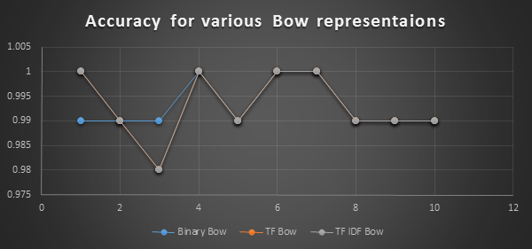

Linear Discriminant Functions
=============
Naïve Bayes algorithm was a Generative algorithm, we generated a model for the data and then tried to predict something. Now we’ll look into a discriminative way of classifying data. We will not build a model exactly, but will just discriminate them into classes.

    Let  x∈L , we’ll define a linear g(x), such that if x∈C_1 then g(x)>0 else g(x)<0.
    So for any point y∈χ, if g(y)>0, we’ll say y∈C_1, else we’ll say y∈C_2.
    For g(y)=0, it could be either of the two, just toss a coin then.
    So, the problem boils down to generation of g:L→R.
    Intuitively g(x)=0 is hyper plane separating the two classes C_1 and C_2.

We’ll be using the perceptron algorithm to generate g. We try to find the local minima of the risk function by initialling g(x) to some function. The risk function R(ω) is piece wise continuous, hence gradient descent can be used to find its local minima. There exists a rigorous mathematical proof that the algorithm converges using some stochastic approximation.

The perceptron accepts a vectors as input, so we have to vectorise the data.
We can vectorise documents using Bag of Words representations, in which we’ll represent a mail as vector of vocabulary of training set which is already lemmatized.

** Binary Bag of Words:**
We’ll have the value of a word is 1 if it is present in the mail, else it is zero. By this representation we’ll have a vector of 0’s and 1’s for every mail.

** TF Bag of Words: **
The value of a word is proportional to how many times it appears in the mail.  We use a monotonic non decreasing function to map frequency to TF. In this I’ve used a log scaling function.
(We also tend to normalise the frequency by the length of document so that extremums due to large documents are avoided. This normalisation can be done in various ways and I’ve used a degree 2 norm.)

** TF-IDF Bag of Words: **
The entry for term t in the vector for document d is given by tf(t,d) × idf(t,D). This is high whenever the term is frequent in d but occurs infrequently in D
If a word (or term) occurs in every document of a collection of documents D then it does not contain much information about the document (e.g. the word ’the’). To correct for this the inverse document frequency idf(t,D) is defined. This is the log scaled ratio log(|D|/|Dt|   ), where Dt is the subset of documents from D that contain the term t.

It is apparent that even in this method we do not consider the semantic ordering of words to be relevant. Also if the query has a new word that is not present in the vocabulary of the learning set, it is simply ignored!

Results
==
 + ** Binary Bag of Words **

| Cross      | 1    | 2    | 3    | 4    | 5    | 6    | 7    | 8    | 9    | 10   |
|------------|------|------|------|------|------|------|------|------|------|------|
| Accuracy   | 0.99 | 0.99 | 0.99 | 1.00 | 0.99 | 1.00 | 1.00 | 0.99 | 0.99 | 0.99 |
| Precision  | 0.98 | 1.00 | 0.98 | 1.00 | 0.98 | 1.00 | 1.00 | 0.96 | 0.96 | 1.00 |
| Recall     | 0.98 | 0.96 | 0.98 | 1.00 | 0.98 | 1.00 | 1.00 | 1.00 | 1.00 | 0.94 |

 + ** TF Bag of Words **

| Cross      | 1    | 2    | 3    | 4    | 5    | 6    | 7    | 8    | 9    | 10   |
|------------|------|------|------|------|------|------|------|------|------|------|
| Accuracy   | 1.00 | 0.99 | 0.98 | 1.00 | 0.99 | 1.00 | 1.00 | 0.99 | 0.99 | 0.99 |
| Precision  | 0.98 | 0.98 | 0.94 | 1.00 | 1.00 | 1.00 | 1.00 | 0.96 | 0.96 | 0.98 |
| Recall     | 1.00 | 0.98 | 0.96 | 1.00 | 1.00 | 1.00 | 0.98 | 1.00 | 1.00 | 0.94 |

 + ** TF IDF Bag of Words **

| Cross      | 1    | 2    | 3    | 4    | 5    | 6    | 7    | 8    | 9    | 10   |
|------------|------|------|------|------|------|------|------|------|------|------|
| Accuracy   | 1.00 | 0.99 | 0.98 | 1.00 | 0.99 | 1.00 | 1.00 | 0.99 | 0.99 | 0.99 |
| Precision  | 0.98 | 0.98 | 0.94 | 1.00 | 0.96 | 1.00 | 1.00 | 0.96 | 0.96 | 0.98 |
| Recall     | 1.00 | 0.98 | 0.96 | 1.00 | 1.00 | 1.00 | 0.98 | 1.00 | 1.00 | 0.94 |

There seems to be no clear winner between the representations, although there is statistically insignificant dip in TF IDF Bow, indicating it lost, All of them perform equally well.
